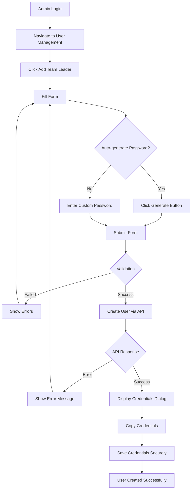
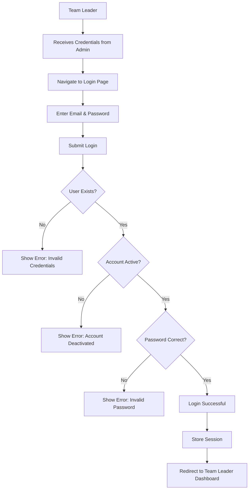
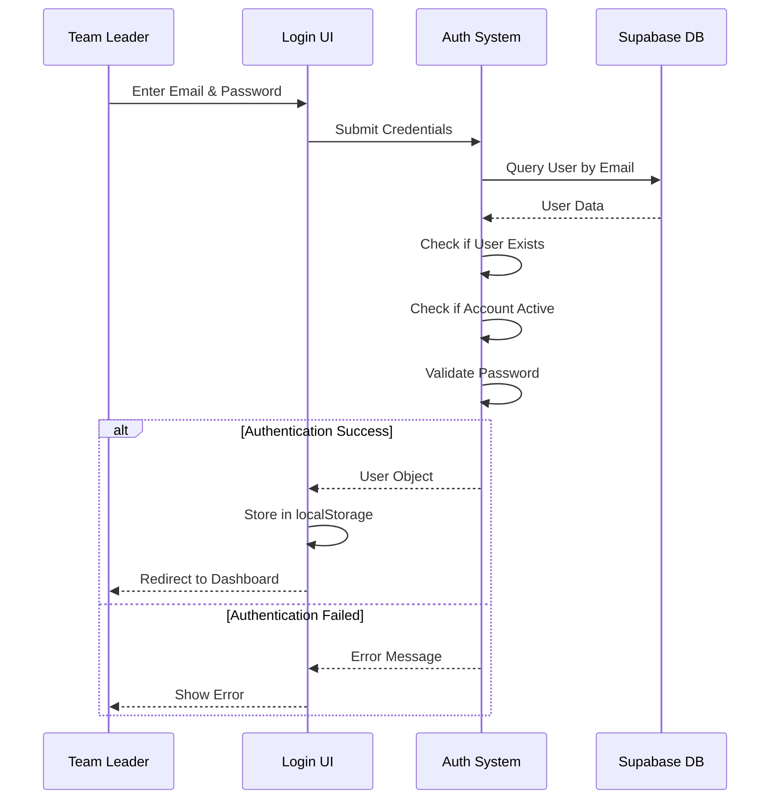
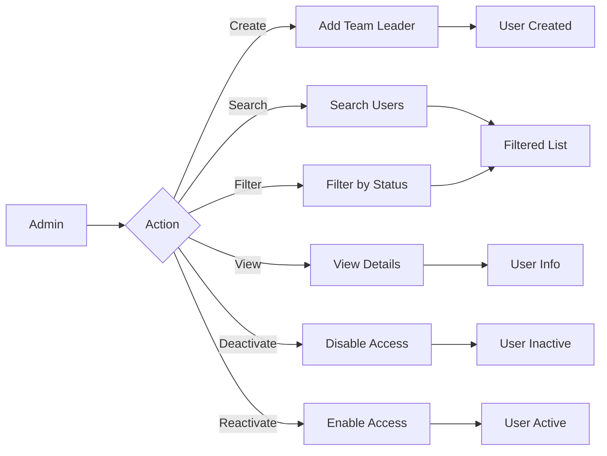
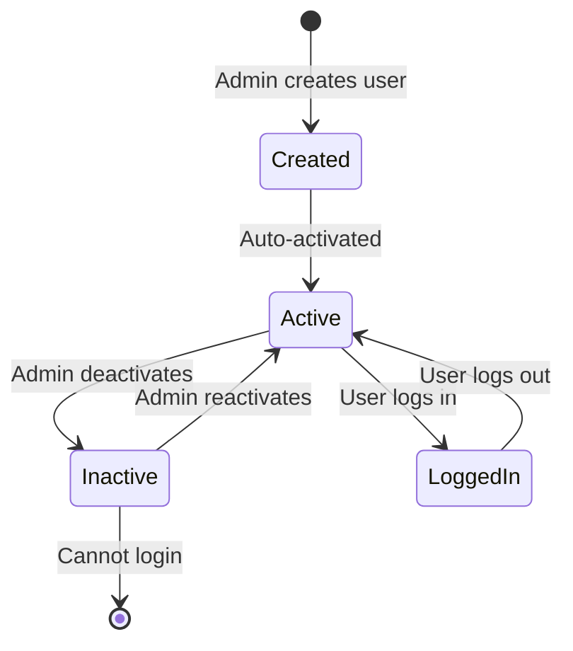
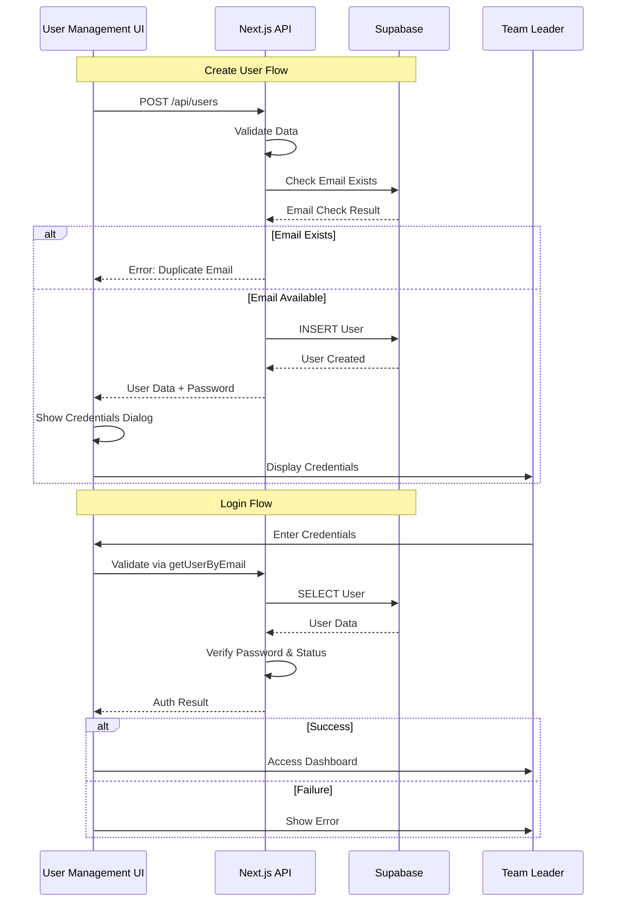
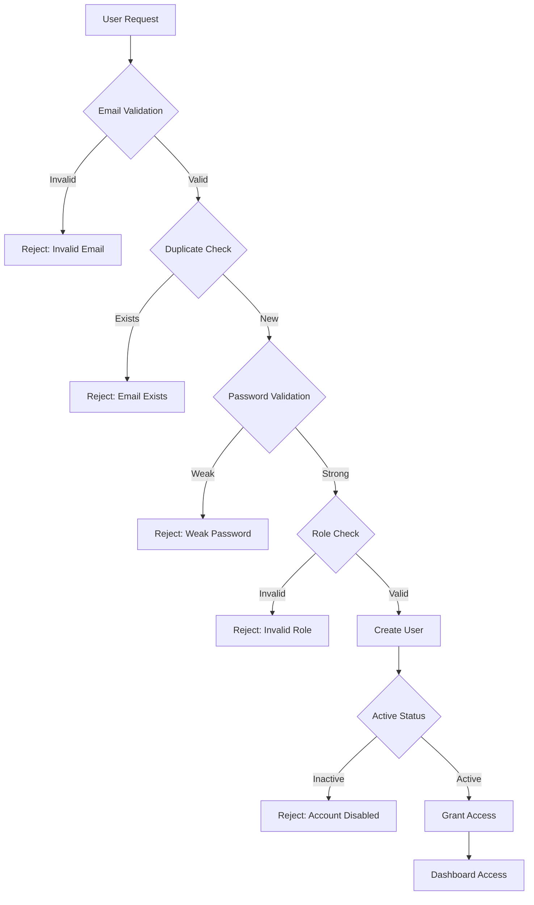
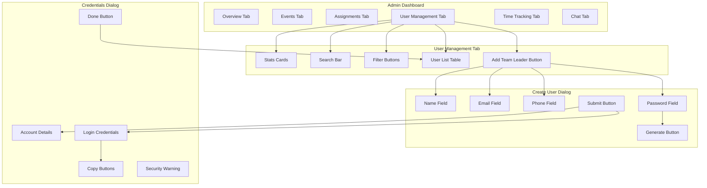
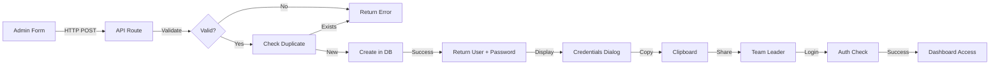

# User Management Workflow Visualization

## 🔄 Complete User Lifecycle



## 👤 Team Leader Login Flow



## 🔐 Authentication Flow



## 👥 User Management Operations



## 📊 User States



## 🔄 API Request Flow



## 🎯 Feature Access Matrix

```
┌─────────────────────┬───────────┬──────────────┐
│ Feature             │   Admin   │ Team Leader  │
├─────────────────────┼───────────┼──────────────┤
│ Create Events       │     ✅    │      ❌      │
│ View Events         │     ✅    │      ✅      │
│ Respond to Events   │     ❌    │      ✅      │
│ Assign Staff        │     ✅    │      ❌      │
│ Manage Users        │     ✅    │      ❌      │
│ Create Team Leaders │     ✅    │      ❌      │
│ View Assignments    │     ✅    │      ✅      │
│ Track Time          │     ✅    │      ❌      │
│ View Own Earnings   │     ❌    │      ✅      │
│ Generate Reports    │     ✅    │      ❌      │
│ Access Chat         │     ✅    │      ✅      │
└─────────────────────┴───────────┴──────────────┘
```

## 🔒 Security Layers



## 📱 User Interface Flow



## 🎬 User Journey Map

### Admin Creating Team Leader

```
1. LOGIN
   ↓
2. Navigate to User Management
   ↓
3. Click "Add Team Leader"
   ↓
4. Fill Form (Name, Email, Phone)
   ↓
5. Generate Password (or custom)
   ↓
6. Submit Form
   ↓
7. View Success Dialog
   ↓
8. Copy Credentials
   ↓
9. Share with Team Leader
   ↓
10. COMPLETE
```

### Team Leader First Login

```
1. Receive Credentials from Admin
   ↓
2. Navigate to Platform
   ↓
3. Enter Email & Password
   ↓
4. Click Sign In
   ↓
5. Redirect to Dashboard
   ↓
6. Explore Features
   ↓
7. Respond to Events
   ↓
8. Track Assignments
   ↓
9. View Earnings
   ↓
10. ACTIVE USER
```

## 💾 Data Flow



## 🔄 State Management

```
Component State (user-management.jsx):
├── teamLeaders: []           // List of all team leaders
├── loading: false            // Loading state
├── showCreateForm: false     // Dialog visibility
├── showCredentials: {}       // Credential visibility per user
├── selectedUser: null        // Currently selected user
├── showDeleteDialog: false   // Deactivate confirmation
├── searchTerm: ''            // Search query
├── filterStatus: 'all'       // Filter selection
├── formData: {...}           // Form inputs
├── formErrors: {}            // Validation errors
├── submitting: false         // Submit state
└── createdUser: null         // Newly created user with password
```

## 📈 Success Metrics

```
Key Performance Indicators:

┌─────────────────────────┬─────────┬──────────┐
│ Metric                  │ Target  │  Status  │
├─────────────────────────┼─────────┼──────────┤
│ User Creation Time      │  < 30s  │    ✅    │
│ Login Success Rate      │  > 95%  │    ✅    │
│ Search Response Time    │  < 1s   │    ✅    │
│ Form Validation         │  100%   │    ✅    │
│ Duplicate Prevention    │  100%   │    ✅    │
│ Credential Copy Success │  > 99%  │    ✅    │
└─────────────────────────┴─────────┴──────────┘
```

---

**Note**: These diagrams provide a visual representation of the user management workflow. For implementation details, refer to the code files and documentation.
